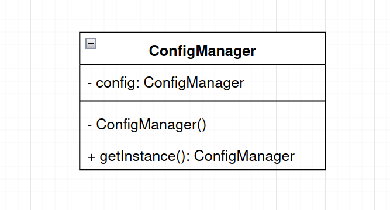
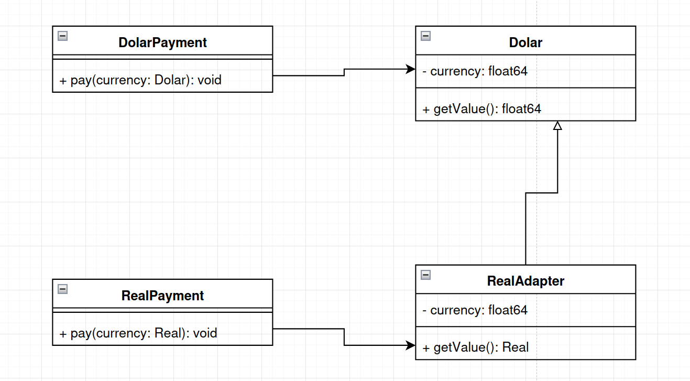
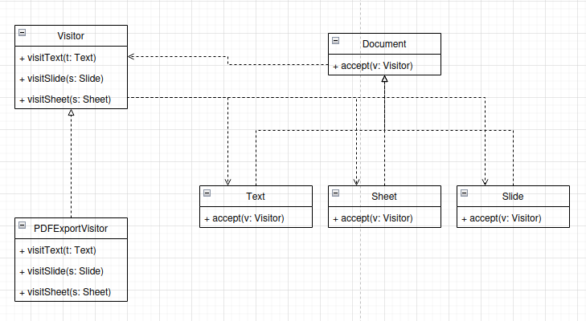

# Padrões de Projeto

Um padrão de projeto é uma solução típica para um problema recorrente no desenvolvimento de software. Funciona como um modelo que pode ser adaptado e aplicado em diferentes contextos para resolver problemas específicos de projeto. Não é um código específico, mas um conceito geral que descreve uma abordagem para resolver um problema.

Existem três grupos principais de padrões de projeto:

- Padrões Criacionais: Eles lidam com mecanismos de criação de objetos, aumentando a flexibilidade e a reutilização de código. Exemplos incluem _Singleton_, _Factory Method_ e _Abstract Factory_.

- Padrões Estruturais: Estes padrões explicam como montar objetos e classes em estruturas maiores, mantendo a flexibilidade e a eficiência. Exemplos incluem _Adapter_, _Decorator_ e _Proxy_.

- Padrões Comportamentais: Eles se concentram na comunicação eficiente e na atribuição de responsabilidades entre objetos. Exemplos incluem _Observer_, _Visitor_, _Strategy_ e _Command_.

## _Singleton_(Criacional)

O _singleton_ é um padrão de projeto que garante que uma classe tenha apenas uma instância e fornece um ponto de acesso global para a mesma.

Dessa forma este modelo, acaba por resolver dois problemas: o de assegurar que uma clase tenha uma única instância e o de prover um ponto de acesso global para está instância. Isso é principalmente útil no acesso a recursos compartilhados e evitar a criação de múltiplas instâncias de uma mesma classe.

Sua estrutura geralmente consiste em uma única classe com um método estático `getInstance()` que retorna está única instância da classe e um construtor privado para impedir a criação direta do objeto.

#### Exemplo

Um simples exemplo do uso deste padrão, pode ser observado em um gerenciador de configurações que armazena informações importantes sobre todo o sistema. A representação dessa classe pode ser observada na imagem abaixo:

**OBS:** Na linguagem go a implementação das classes é feita de maneira diferente do habitual em outras linguagens. Logo o modelo acima sofreu alterações antes de ser implementado.

## _Adapter_(Estutural)

O padrão _adapter_ é usado quando há necessidade de fazer interfaces incompatíveis trabalharem juntos.

Um adaptor encobre um dos objetos para esconder a complexidade da conversão. O objeto encobrido não fica ciente desta adaptação. Um exemplo simples disso seria encobrir um objeto que opera em metros e quilômetros para um outro que converte todos os dados para unidades imperiais tais como pés e milhas.

A implementação deste adaptor se dá como uma classe _wrapper_ que armazena uma referência para a classe de serviço. Nesta classe _wrapper_ é implementado todas as interfaces de comunicação do cliente e o serviço, todas as chamadas que o cliente faria a classe de serviço, são realizadas ao adaptor que realiza as alterações necessárias e delegar as chamadas para a interface de serviço.

#### Exemplo

Um simples exemplo do uso deste padrão, pode ser observado em uma aplicação de pagamentos que suporta diferentes moedas. Isso pode ser observado na imagem abaixo, que descreve o modelo de classes para pagamentos em dolár e real:

## _Visitor_(Comportamental)

O padrão de projeto visitor é uma técnica útil para separar algoritmos dos objetos sobre os quais eles operam, especialmente em situações onde há hierarquia de classes e não é possível modificá-las diretamente.

Basicamente este padrão cria uma classe(visitante) onde para cada uma das outras classes que ela interage um método diferente é feito.

Este padrão é implementado seguindo os seguintes passos:

1. Interface do Visitante (Visitor Interface): Define os métodos visitantes que podem receber elementos concretos da estrutura de objetos como argumentos.

2. Visitante Concreto (Concrete Visitor): Implementa as diferentes variantes do mesmo comportamento para diferentes elementos concretos da estrutura de objetos.

3. Interface do Elemento (Element Interface): Declara um método para "aceitar" visitantes. Este método redireciona a chamada para o método visitante apropriado que corresponde à classe atual do elemento.

4. Elemento Concreto (Concrete Element): Implementa o método de aceitação e redireciona a chamada para o método visitante apropriado.

5. Cliente (Client): Utiliza os objetos visitantes para executar operações sobre os elementos da estrutura de objetos, sem conhecer as classes concretas dos elementos.

#### Exemplo

Uma situação real onde podemos encontrar este tipo de padrão, seria em um sistema de exportação de documentos onde temos diferentes tipos de documentos, como documentos de texto, planilhas e apresentações. Queremos implementar uma funcionalidade de exportação para diferentes formatos, como PDF por exemplo, sem a necessidade de modificar as classes existentes. A imagem abaixo, ilustra o como esse modelo seria implementado:

